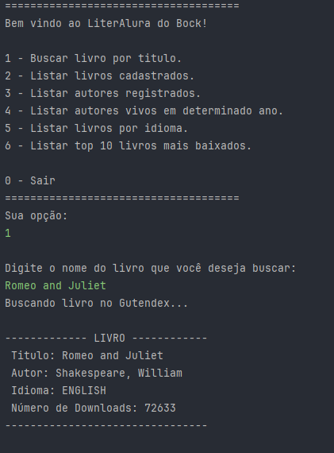
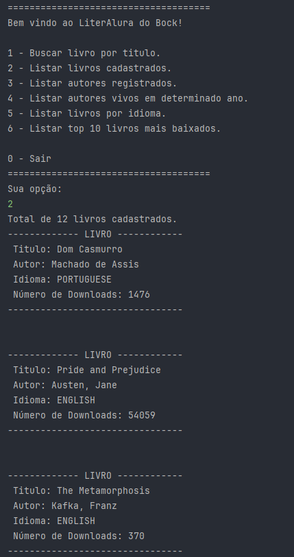
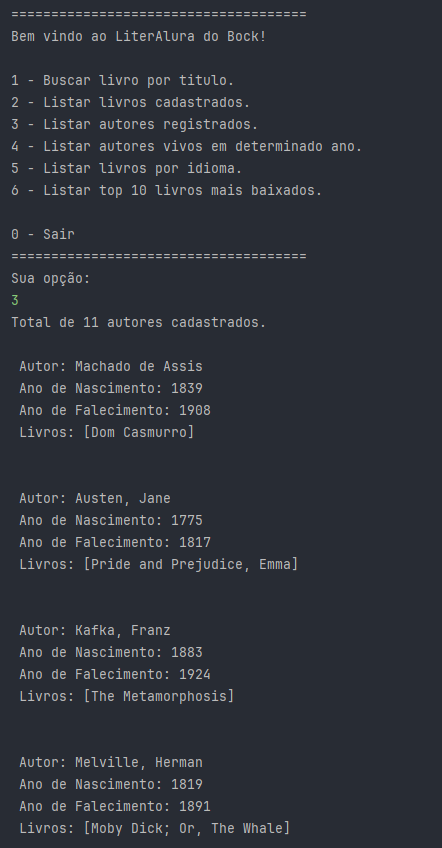
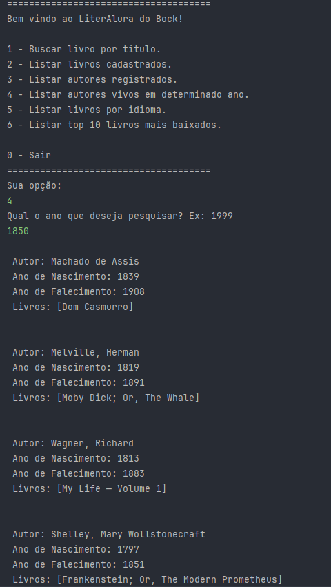
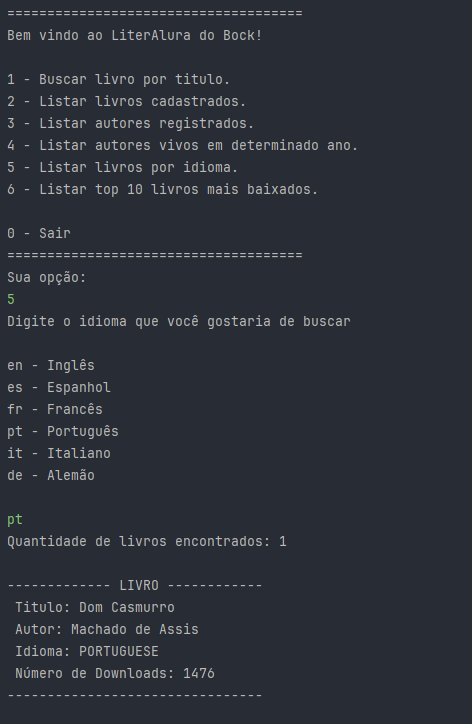
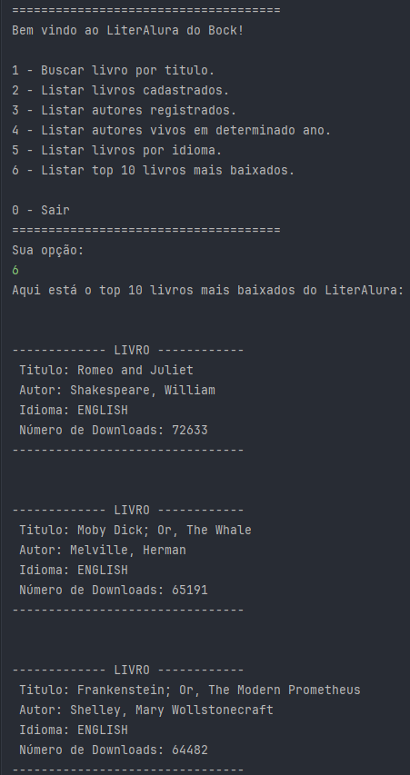

  # LiterAlura do Bock

O LiterAlura é um challenge criado pela Alura, visando aplicar os conhecimentos adquiridos na formação Spring Boot do projeto Hello One. O objetivo é consultar a api do [Gutendex](https://gutendex.com/), persistir os livros e autores em um banco de dados local e oferecer interação textual com o usuário.

## Técnicas e tecnologias utilizadas

- ``Java 17``
- ``Maven 3 ou acima``
- ``PostgreSQL 16``
- ``Docker``

## Funcionalidades do projeto

- ``Buscar livro por titulo``: É perguntado o nome do livro a ser buscado, caso não seja encontrado já cadastrado, ele será buscado na API do Gutendex e persistido no banco de dados.

- ``Listar livros cadastrados``: Busca todos os livros cadastrados, e os mostra no terminal contendo o nome do autor.

- ``Listar autores registrados``: Busca todos os autores cadastrados, e os mostra no terminal contendo também todos os nomes dos livros já salvos.

- ``Listar autores vivos em determinado ano``: Busca dentre os autores, utilizando da data passada via terminal, e retorna os autores que estavam vivos naquele ano.

- ``Listar livros por idioma``: Lista os principais idiomas e busca no banco de dados utilizando o escolhido pelo usuário.

- ``Listar top 10 livros mais baixados``: Lista os livros cadastrados mais baixados, em ordem decrescente.

## Como usar

Tecnologias necessárias: JDK 17 ou acima e Docker.

1 - Clone esse repositório para a máquina local.

2 - Vá até o diretório da aplicação e abra-o com a sua IDE de preferência.

3 - Digite ``docker compose up -d`` e isso subirá um novo container para o banco de dados em segundo plano.

4 - Agora, execute o método main da classe LiteraluraApplication.